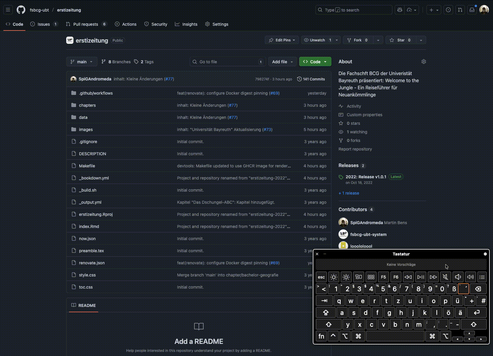
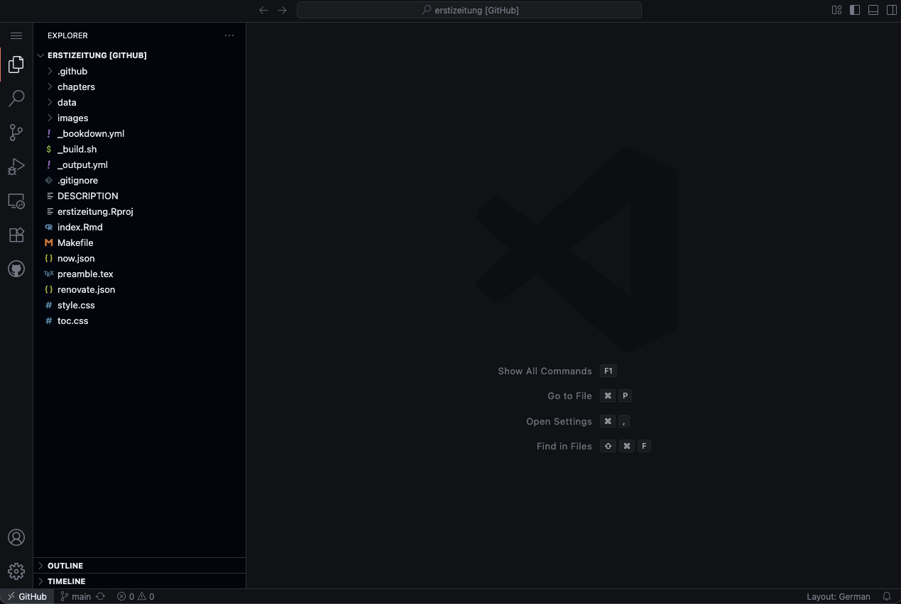
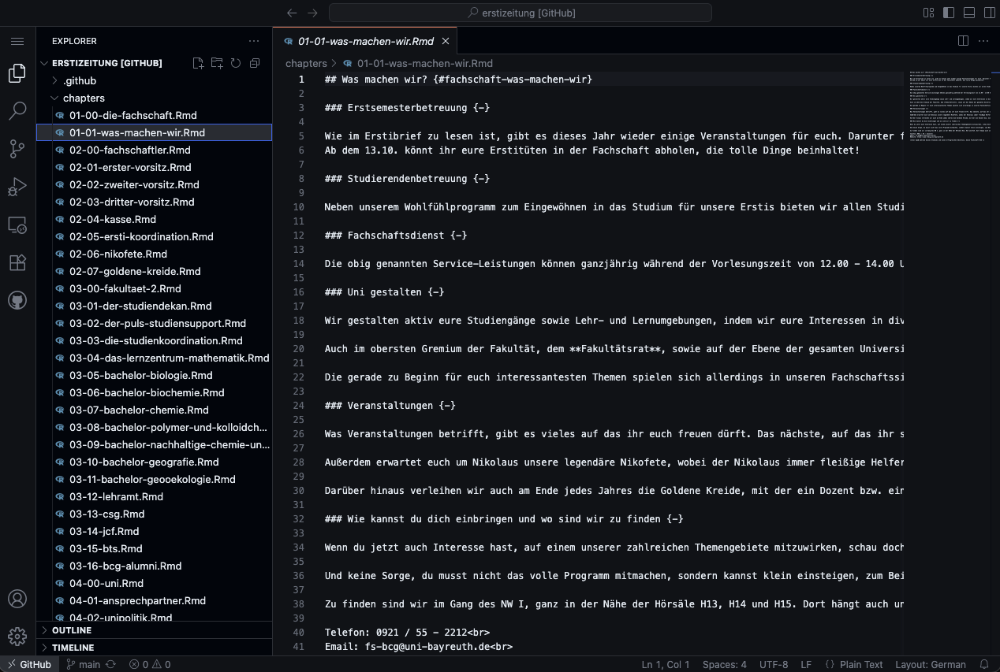
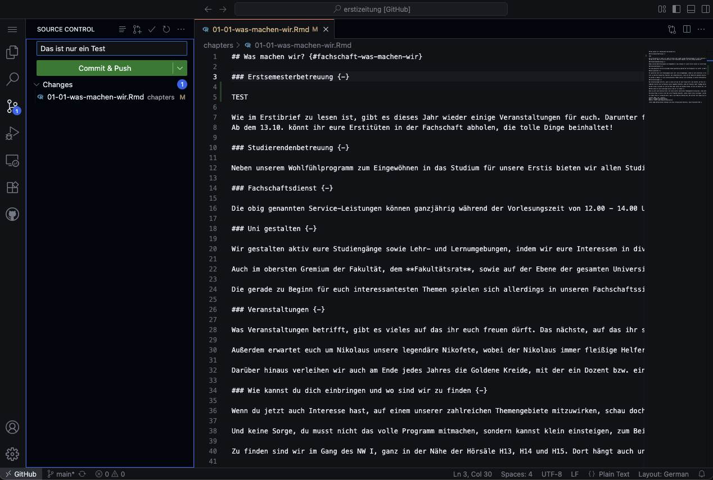
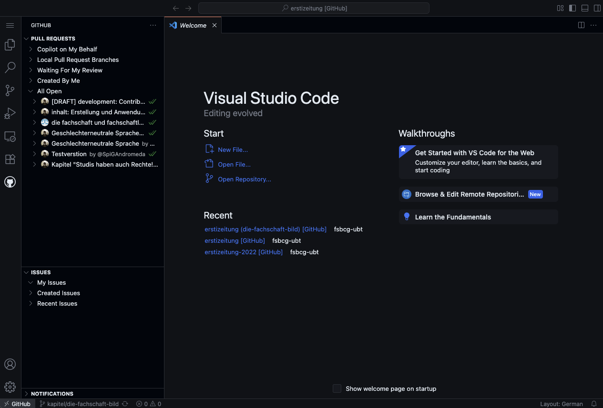
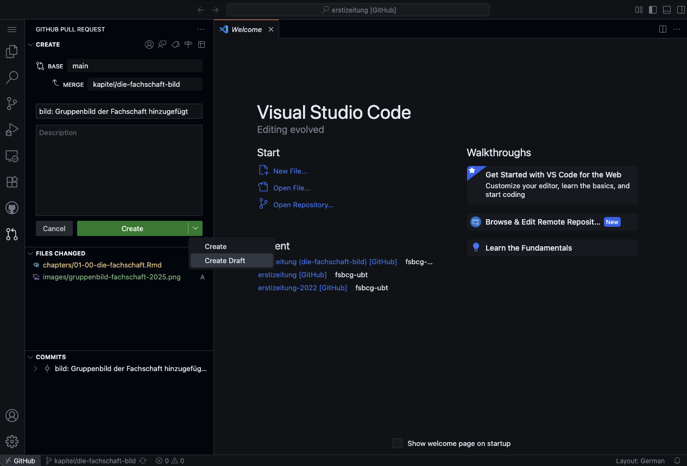

# Beitragen zur Erstizeitung

Willkommen! Dieses Dokument erklärt, wie du Inhalte zur Erstizeitung der Fachschaft BCG beitragen kannst. Es ist speziell für Personen ohne technischen Hintergrund geschrieben.

> **Hinweis:** Dieses Dokument verwendet technische Begriffe aus der Git-Welt. Eine Erklärung aller wichtigen Begriffe findest du im [Glossar](#glossar-wichtiger-begriffe) am Ende des Dokuments.

## Dateistruktur

```
erstizeitung/
├── chapters/             # Alle Kapitel als .Rmd Dateien
│   ├── 01-*.Rmd          # Kapitel 1: Die Fachschaft
│   ├── 02-*.Rmd          # Kapitel 2: Fachschaftsmitglieder
│   ├── 03-*.Rmd          # Kapitel 3: Fakultät II
│   └── ...
├── images/               # Alle Bilder
│   ├── fachschaft/       # Fotos der Fachschaftsmitglieder
│   └── ...
├── data/                 # Daten (z.B. Termine, Kontakte)
├── index.Rmd             # Hauptdatei mit Metadaten
├── _bookdown.yml         # Bookdown-Konfiguration
└── _output.yml           # Ausgabeformate-Konfiguration
```

## Bearbeitung im Browser (Empfohlen)

Die einfachste Möglichkeit, die Erstizeitung zu bearbeiten, ist direkt im Browser mit der GitHub VS Code Web-Version. Du benötigst dafür nur einen GitHub-Account und einen modernen Webbrowser.

### VS Code Web-Editor öffnen

1. **Repository im Browser öffnen**: Navigiere zum Repository auf GitHub
2. **Web-Editor starten**: Drücke die Taste `.` (Punkt) auf deiner Tastatur, oder ändere die URL von `github.com` zu `github.dev`



### Wichtiger Hinweis zur Browser-Sprache

<details>
<summary>⚠️ <strong>Achtung vor automatischen Browser-Übersetzungen</strong> (Klicken für Details)</summary>

> Moderne Browser (Chrome, Edge, Safari) bieten automatische Übersetzungen an, wenn sie erkennen, dass eine Webseite nicht in deiner Systemsprache ist. Diese automatischen Übersetzungen können bei technischen Dokumentationen und Code-Editoren zu erheblichen Problemen führen:
>
> - **Technische Begriffe** werden oft falsch oder irreführend übersetzt
> - **Code-Befehle** und **Git-Kommandos** können verfälscht werden
> - **Dateinamen** und **Pfade** werden möglicherweise verändert
> - Die Übersetzung kann zu **Missverständnissen** und **Fehlern** führen

#### Empfohlene Lösung: Browser auf Englisch umstellen

Für die beste Erfahrung mit VS Code Web und github.dev empfehlen wir, deinen Browser auf Englisch zu nutzen oder die automatische Übersetzung zu deaktivieren:

**Chrome:**
1. Öffne Chrome-Einstellungen (⋮ → Einstellungen)
2. Navigiere zu "Sprachen" (oder suche danach)
3. Deaktiviere "Übersetzung von fremdsprachigen Seiten anbieten"
4. Optional: Füge Englisch als bevorzugte Sprache hinzu und setze es an erste Stelle

**Microsoft Edge:**
1. Öffne Edge-Einstellungen (⋯ → Einstellungen)
2. Navigiere zu "Sprachen"
3. Deaktiviere "Anbieten, Seiten zu übersetzen, die nicht in einer Sprache verfasst sind, die Sie lesen"
4. Optional: Füge Englisch als bevorzugte Sprache hinzu

**Firefox:**
- Firefox hat standardmäßig keine automatische Übersetzung
- Falls du Übersetzungs-Erweiterungen installiert hast, deaktiviere diese für github.com und github.dev

**Safari:**
- Deaktiviere installierte Übersetzungs-Erweiterungen für github.com
- Oder nutze die Safari-Einstellungen → Erweiterungen, um Übersetzungen zu deaktivieren

#### Alternative: Sprache temporär umstellen

Wenn du die Übersetzung nicht dauerhaft deaktivieren möchtest, kannst du auch nur für die Arbeit mit der Erstizeitung die Browser-Sprache temporär auf Englisch umstellen. Dies stellt sicher, dass alle technischen Begriffe, Befehle und Menüs korrekt angezeigt werden.

</details>

### Im Web-Editor arbeiten

Der VS Code Web-Editor bietet eine vollständige Entwicklungsumgebung im Browser:



#### Branch erstellen (Wichtiger erster Schritt!)

Bevor du mit der Bearbeitung beginnst, erstelle immer einen neuen Branch:

1. **Branch-Symbol klicken**: Klicke unten links auf den aktuellen Branch-Namen (meist `main`)
2. **Neuen Branch erstellen**: Wähle "Create new branch..." aus dem Menü
3. **Branch benennen**: Verwende einen aussagekräftigen Namen nach der Namenskonvention
4. **Von main erstellen**: Stelle sicher, dass der neue Branch vom `main` Branch abzweigt

**Namenskonvention für Branches:**
- Für Kapitel-spezifische Änderungen: `kapitel/beschreibung-der-aenderung`
- Für übergreifende Änderungen (z.B. Sprachleitfaden): `allgemein/beschreibung`
- Für technische Änderungen: Frag den Maintainer 🙃

#### Dateien bearbeiten

1. **Explorer öffnen**: Klicke auf das Datei-Symbol in der linken Seitenleiste
2. **Datei auswählen**: Navigiere zu `chapters/` und wähle die zu bearbeitende `.Rmd` Datei
3. **Änderungen vornehmen**: Bearbeite den Text direkt im Editor



#### Änderungen speichern und committen

1. **Source Control öffnen**: Klicke auf das Git-Symbol in der linken Seitenleiste
2. **Änderungen überprüfen**: Sieh dir die Änderungen im Diff-View an
3. **Commit-Nachricht eingeben**: Verwende die [Commit-Konventionen](#commits-erstellen) (z.B. `inhalt: Bachelor Biochemie aktualisiert`)
4. **Commit erstellen**: Klicke auf den Commit-Button (✓)



#### Pull Request erstellen

1. **Pull Request Panel öffnen**: Klicke auf das Pull Request Symbol in der Seitenleiste
2. **Neuen Pull Request erstellen**: Folge den Anweisungen im Interface
3. **Beschreibung hinzufügen**: Erkläre deine Änderungen





## Workflow für Inhaltsanpassungen

Diese Anleitung beschreibt den Workflow für die empfohlene Browser-basierte Bearbeitung mit dem VS Code Web-Editor.

### Grundprinzipien

1. **Kapitel unabhängig bearbeiten**: Jedes Kapitel wird in einem eigenen [Branch](#glossar-wichtiger-begriffe) bearbeitet
2. **Parallele Bearbeitung**: Mehrere Unterkapitel können gleichzeitig von verschiedenen Personen bearbeitet werden
3. **Saubere Historie**: Jeder [Commit](#glossar-wichtiger-begriffe) sollte eine logisch zusammenhängende Änderung enthalten

### Schritt-für-Schritt Anleitung

> **Wichtig:** Du solltest bereits einen neuen Branch erstellt haben, wie im vorherigen Abschnitt beschrieben. Falls nicht, erstelle jetzt einen Branch bevor du fortfährst!

#### 1. Änderungen vornehmen

Bearbeite die entsprechenden `.Rmd` Dateien direkt im VS Code Web-Editor:

1. **Explorer öffnen**: Klicke auf das Datei-Symbol in der linken Seitenleiste
2. **Kapitel navigieren**: Öffne den `chapters/` Ordner
3. **Datei auswählen**: Klicke auf die zu bearbeitende `.Rmd` Datei
4. **Änderungen durchführen**: Bearbeite den Inhalt im Editor

Die Dateistruktur:
```
chapters/
├── 01-00-die-fachschaft.Rmd       # Hauptkapitel 1
├── 01-01-was-machen-wir.Rmd       # Unterkapitel 1.1
├── 02-00-fachschaftler.Rmd        # Hauptkapitel 2
├── 02-01-erster-vorsitz.Rmd       # Unterkapitel 2.1
└── ...
```

#### 2. [Commits](#glossar-wichtiger-begriffe) erstellen

Speichere deine Änderungen als Commit im VS Code Web-Editor:

1. **Source Control öffnen**: Klicke auf das Git-Symbol in der linken Seitenleiste
2. **Änderungen überprüfen**: Schaue dir die Änderungen im Diff-View an
3. **Dateien stagen**: Klicke auf das `+` Symbol bei den gewünschten Dateien
4. **Commit-Nachricht eingeben**: Folge den Commit-Konventionen (siehe unten)
5. **Commit erstellen**: Klicke auf den Commit-Button (✓) oder drücke Ctrl+Enter

<details>
<summary>📋 <strong>Commit-Konventionen und Beispiele</strong></summary>

**Commit-Konventionen:**

| Präfix | Verwendung | Beispiel |
|--------|------------|----------|
| `inhalt:` | Inhaltliche Änderungen | `inhalt: Bachelor Biochemie Modulplan aktualisiert` |
| `daten:` | Datenaktualisierungen | `daten: Termine WiSe 2024/25 eingefügt` |
| `bilder:` | Bildänderungen | `bilder: Neue Fotos der Fachschaftsmitglieder` |
| `format:` | Formatierungsänderungen | `format: Einheitliche Überschriftenebenen` |

**Wichtige Regeln:**
- Gesamte Commit-Nachricht maximal 72 Zeichen
- Präfix + Leerzeichen + kurze, prägnante Beschreibung
- Verwende Präsens ("aktualisiert" statt "aktualisierte")

</details>

#### 3. [Pull Request](#glossar-wichtiger-begriffe) erstellen

Erstelle einen Pull Request direkt im VS Code Web-Editor:

1. **Source Control Panel**: Stelle sicher, dass alle Commits gepusht sind (Sync-Button klicken)
2. **Pull Request erstellen**: Klicke auf "Create Pull Request" im Source Control Panel
   - Alternativ: Nutze das Pull Request Symbol in der Seitenleiste
3. **PR-Details ausfüllen**:
   - Titel: Kurze Beschreibung der Änderungen
   - Beschreibung: Ausführliche Erklärung was und warum geändert wurde
4. **Review anfordern**: Der PR wird automatisch zur Review weitergeleitet
5. **Auf Freigabe warten**: Nach der Review werden die Änderungen gemerged

## Lokale Bearbeitung (Für Fortgeschrittene)

<details>
<summary>💻 <strong>Lokale Bearbeitung mit Git</strong> (Für erfahrene Nutzer)</summary>

Wenn du lieber mit einer lokalen Kopie des Repositories arbeiten möchtest, kannst du die folgenden Schritte nutzen. Dies erfordert Git auf deinem Computer und ist primär für erfahrene Nutzer gedacht.

### Vorschau der Änderungen

Um deine Änderungen lokal zu überprüfen, kannst du die GitBook-Version mit Docker erstellen:

```bash
make render-gitbook
```

Die generierte HTML-Version findest du dann im `_book/` Verzeichnis.

### Ohne Docker

Falls du R installiert hast:

```r
# Einmalig: Bookdown installieren
install.packages("bookdown")

# GitBook (HTML) erstellen
bookdown::render_book('index.Rmd', 'bookdown::gitbook')

# PDF erstellen
bookdown::render_book('index.Rmd', 'bookdown::pdf_book')
```

</details>

## Häufige Aufgaben

<details>
<summary>➕ <strong>Ein neues Unterkapitel hinzufügen</strong></summary>

1. Erstelle eine neue `.Rmd` Datei im `chapters/` Verzeichnis
2. Benenne sie nach dem Schema: `XX-YY-titel.Rmd` (XX = Kapitelnummer, YY = Unterkapitelnummer)
3. Beginne die Datei mit einer Überschrift zweiter Ebene: `## Titel des Unterkapitels`

</details>

<details>
<summary>🖼️ <strong>Bilder hinzufügen</strong></summary>

1. Speichere Bilder im `images/` Verzeichnis
2. Für Fachschaftsmitglieder-Fotos: Siehe Anleitung in README.md für die Bildbearbeitung
3. Einbinden in .Rmd Dateien: ``

</details>

<details>
<summary>📅 <strong>Termine oder Daten aktualisieren</strong></summary>

1. Bearbeite die entsprechenden Dateien im `data/` Verzeichnis
2. Verwende das Präfix `daten:` für deine Commit-Nachricht

</details>

<details>
<summary>🔤 <strong>Übergreifende Sprachanpassungen</strong></summary>

Für Änderungen, die mehrere Kapitel betreffen (z.B. Anwendung eines Sprachleitfadens):

1. Erstelle einen [Branch](#glossar-wichtiger-begriffe): `allgemein/sprachleitfaden`
2. Nimm alle Änderungen in diesem [Branch](#glossar-wichtiger-begriffe) vor
3. [Commit](#glossar-wichtiger-begriffe)-Nachricht: `inhalt: Sprachleitfaden angewendet`

</details>

## Hilfe und Unterstützung

Bei Fragen oder Problemen:

1. Öffne ein Issue auf GitHub
2. Kontaktiere die Fachschaft: [fs-bcg@uni-bayreuth.de](mailto:fs-bcg@uni-bayreuth.de)
3. Schau in die bestehenden [Pull Requests](#glossar-wichtiger-begriffe) für Beispiele

## Glossar wichtiger Begriffe

<details>
<summary>📚 <strong>Glossar der Git-Begriffe</strong></summary>

| Begriff | Erklärung |
|---------|-----------|
| **Repository (Repo)** | Der Speicherort des gesamten Projekts auf GitHub, enthält alle Dateien und deren Versionsgeschichte |
| **Branch** | Eine parallele Version des Projekts, in der Änderungen isoliert vorgenommen werden können |
| **Commit** | Eine gespeicherte Änderung mit Beschreibung, wie ein Schnappschuss des aktuellen Stands |
| **Pull Request (PR)** | Eine Anfrage, deine Änderungen aus einem Branch in den Hauptbranch zu übernehmen |
| **Merge** | Das Zusammenführen von Änderungen aus einem Branch in einen anderen |
| **Clone** | Eine lokale Kopie des Repositories auf deinem Computer |
| **Push** | Hochladen deiner lokalen Commits zu GitHub |
| **Pull** | Herunterladen von Änderungen aus GitHub auf deinen Computer |

</details>

---

Vielen Dank für deinen Beitrag zur Erstizeitung! 🎓