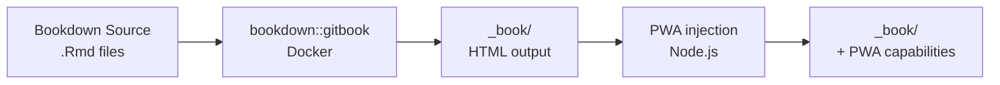

# PWA Integration for Bookdown GitBook

[](https://www.typescriptlang.org/)
[](https://nodejs.org/)
[](https://developer.chrome.com/docs/workbox/)

Transform Bookdown-generated GitBook sites into installable, offline-capable Progressive Web Apps through post-build injection.

---

## Table of Contents

- [Overview](#overview)
- [Features](#features)
- [Installation](#installation)
- [Configuration](#configuration)
- [Testing](#testing)
- [Troubleshooting](#troubleshooting)
- [Security & Privacy](#security--privacy)
- [Development](#development)
- [Contributing](#contributing)
- [Technical Specifications](#technical-specifications)

---

## Overview

Bookdown generates static HTML documentation but lacks Progressive Web App capabilities such as offline access, app installation, and update notifications. This system adds PWA functionality through post-build injection, transforming standard GitBook output into installable web applications without modifying Bookdown templates or R code.

The implementation maintains separation of concerns: Bookdown renders content, Node.js injects the PWA layer. Docker handles R/Bookdown rendering while Node.js handles PWA tooling (TypeScript compilation, Workbox, icon generation).

### Architecture



---

## PWA Features

- **Offline access**: All pages precached
- **Automatic updates**: User notifications for new versions
- **Network status**: Visual offline indicator
- **CSP compliant**: No inline styles
- **Template-based**: Single codebase, multiple deployment targets via `{{BASE_PATH}}`

---

## Installation

### Prerequisites

- Node.js (see `.nvmrc`)
- Docker: For Bookdown rendering (`ghcr.io/fsbcg-ubt/docker-bookdown`)
- Make: For build automation

### Build GitBook with PWA

```bash
make render-pwa
```

Renders Bookdown to `_book/` directory, installs Node.js dependencies, compiles TypeScript source files, generates service worker with Workbox, and injects PWA files into HTML.

### Start Development Server

```bash
cd pwa && npm run serve
```

### Verify PWA Functionality

Open http://localhost:3000 in your browser and verify:

1. Install prompt appears (desktop/mobile)
2. Offline mode works (Chrome DevTools → Network → Offline)
3. Service worker is active (DevTools → Application → Service Workers)

---

## Configuration

### BASE_PATH Setup

Configure deployment environment by setting the `BASE_PATH` environment variable:

| Environment       | BASE_PATH Value   | Result                                         |
| ----------------- | ----------------- | ---------------------------------------------- |
| Local Development | `""` (empty)      | Root-relative paths (`/manifest.json`)         |
| GitHub Pages      | `"/erstizeitung"` | Prefixed paths (`/erstizeitung/manifest.json`) |

Build for local development (default):

```bash
make render-pwa
```

Build for production (GitHub Pages):

```bash
make render-pwa BASE_PATH=/erstizeitung
```

Note: Local dev servers serve from root directory, while GitHub Pages requires path prefixes for subpath deployments.

### PWA Manifest

Customize app identity in `manifest.template.json`:

```json
{
  "name": "Erstizeitung",
  "short_name": "Erstizeitung",
  "theme_color": "#249260",
  "icons": [...]
}
```

- `name`: Full application name
- `short_name`: Home screen label
- `theme_color`: `#249260` (University of Bayreuth green)
- `icons`: Multiple sizes auto-generated from `fsbcg-logo.png`

### Service Worker Caching

Configure caching behavior in `workbox-config.ts`:

| Resource Type        | Strategy             | Expiration  |
| -------------------- | -------------------- | ----------- |
| HTML                 | NetworkFirst         | Short-term  |
| CSS/JS               | StaleWhileRevalidate | Medium-term |
| Images               | CacheFirst           | Long-term   |
| Documents (PDF/EPUB) | CacheFirst           | Long-term   |
| MathJax CDN          | CacheFirst           | Long-term   |

Settings:

- `cacheId: "erstizeitung-v1"`: Cache namespace
- `skipWaiting: false`: Requires user confirmation for updates
- `globPatterns`: Files to precache at installation

### Visual Styling

Customize PWA UI appearance in `pwa-styles.css`:

- Toast notification colors and positioning
- Consent banner styling (German text)
- Offline indicator design
- Install button appearance

### Regenerate Icons

Update app icons after modifying `fsbcg-logo.png` (high-resolution source):

```bash
npm run generate-icons
```

Generates:

- Standard icons (multiple sizes)
- Maskable icons (with padding)
- Apple touch icon

---

## Testing

### Run Automated Tests

```bash
npm test
```

Test breakdown:

- Unit tests (`inject-html.test.ts`): Validates `validateBasePath()` and `processTemplate()` functions
- Integration tests (`integration.test.ts`): Verifies build output structure and content

Note: Integration tests require `_book/` directory. Run `make render-pwa` before testing.

### Test Commands

```bash
# Development
npm run serve           # Start server at http://localhost:3000
npm run serve:dev       # Same, without clipboard notification

# Building
npm run build           # Compile TypeScript (Node.js + browser targets)
npm run clean           # Remove compiled files

# Testing
npm test                # Run all tests once (CI mode)
npm run test:watch      # Watch mode with auto-rerun
npm run test:ui         # Visual browser-based UI
npm run test:coverage   # Generate HTML coverage report

# Icons
npm run generate-icons  # Regenerate from fsbcg-logo.png
```

### Browser Testing

Start local server and open http://localhost:3000, then validate with Chrome DevTools:

**Verify Manifest**

- Open DevTools → Application → Manifest
- Check: name, theme color, icons display correctly

**Check Service Worker**

- Navigate to Application → Service Workers
- Status should show: "Activated and running"

**Validate Caching**

- Go to Application → Cache Storage
- Verify caches exist: `erstizeitung-v1-precache`, `workbox-runtime-*`

**Test Offline Mode**

- Open Network tab → Check Offline
- Refresh page (should load from cache)

**Test Installation**

- Desktop: Click install icon in address bar
- Mobile: Tap "Add to Home Screen" prompt
- Verify app opens in standalone mode

---

### Debug Commands

Open Chrome DevTools Console and run:

```javascript
// Check service worker registrations
navigator.serviceWorker.getRegistrations().then((regs) => console.log(regs));

// List all caches
caches.keys().then((keys) => console.log(keys));

// Check consent status
localStorage.getItem('pwa-consent');
```

---

## Contributing

See [CONTRIBUTING.md](CONTRIBUTING.md) for code comment guidelines and best practices.

---

## Technical Specifications

| Component            | Details                                     | Reference                                                                                 |
| -------------------- | ------------------------------------------- | ----------------------------------------------------------------------------------------- |
| TypeScript           | Strict mode enabled                         | -                                                                                         |
| Workbox              | Latest stable version                       | [Documentation](https://developer.chrome.com/docs/workbox/)                               |
| Test Framework       | Vitest with V8 coverage                     | -                                                                                         |
| Node.js              | LTS version                                 | -                                                                                         |
| Cheerio              | HTML parsing                                | -                                                                                         |
| Dependencies         | No known vulnerabilities                    | -                                                                                         |
| Cache Size           | All pages precached                         | -                                                                                         |
| Service Worker Scope | `/` (local) or `${BASE_PATH}/` (production) | [Service Worker API](https://developer.mozilla.org/en-US/docs/Web/API/Service_Worker_API) |
| TypeScript Target    | ES2022 (Node.js), ES2020 (Browser)          | -                                                                                         |
| Test Coverage        | Comprehensive coverage                      | -                                                                                         |
| PWA Guide            | Progressive Web Apps fundamentals           | [MDN PWA Guide](https://developer.mozilla.org/en-US/docs/Web/Progressive_web_apps)        |
| PWA Tutorial         | Interactive PWA learning resources          | [Web.dev Learn PWA](https://web.dev/learn/pwa/)                                           |
| Web App Manifest     | PWA manifest specification                  | [Web App Manifest](https://developer.mozilla.org/en-US/docs/Web/Manifest)                 |
